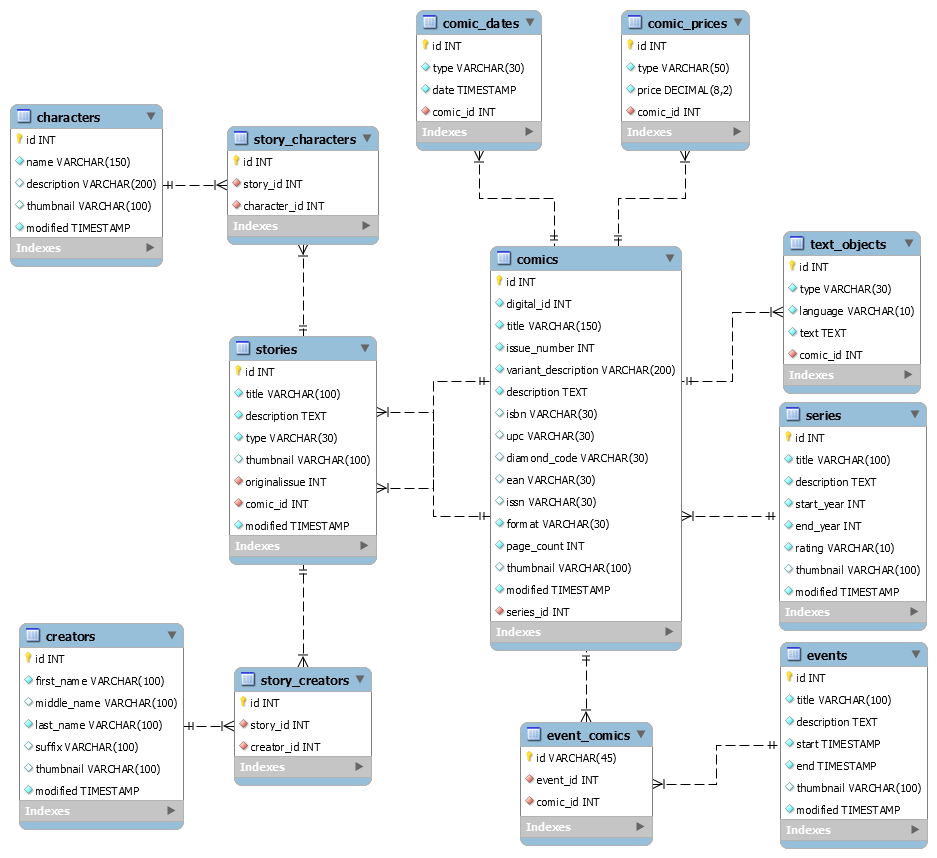

## Descrição

Projeto Laravel com implementação de API utilizando as mesmas estruturas e regras da API da Marvel.

### Fontes utilizadas
- https://developer.marvel.com/documentation/entity_types
- https://developer.marvel.com/docs#!/public

### Modelagem do Banco de Dados

<p align="center">
  
</p>

### Endpoints Implementados

- /v1/public/characters
- /v1/public/characters/{characterId}
- /v1/public/characters/{characterId}/comics
- /v1/public/characters/{characterId}/events
- /v1/public/characters/{characterId}/series
- /v1/public/characters/{characterId}/stories

### Features Implementadas

- Estruturade JSON da MArvel
- Limite de resouces em uma listagem
- Offset do início de listagem

## Instalação

### Download do Projeto

```bash
git clone https://github.com/telesduf1/marvel-api
```

### 2.Configuração

Copie o arquivo de configuração com as variáveis de ambiente.

```bash
cp .env.example .env
```

Insira as credenciais do banco alterando as variáveis DB_HOST, DB_PORT, DB_DATABASE, DB_USERNAME e DB_PASSWORD

### 3. Dependências

Faça a instalação de todas as dependências com o composer.

```bash
composer install
```

### 4. Chave de Aplicação

Gere a chave de aplicação. Caso tenha instalado utilizando o composer para a instalação do projeto a chave já está setada. 

```bash
php artisan key:generate
```

### 4. Migrations/Seeds

Execute o comando abaixo para gerar a estrutura do banco de dados com todas as tabelas e alguns dados para testes.

```bash
php artisan migrate:fresh --seed
```

## Execução

Para executar a aplicação digite o comando abaixo.

```bash
php artisan serve
```

Aplicação ficará acessível em http://localhost:8000.

## Testes

Para executar os testes de feature implementados, digite o comando abaixo.

```bash
php artisan test
```